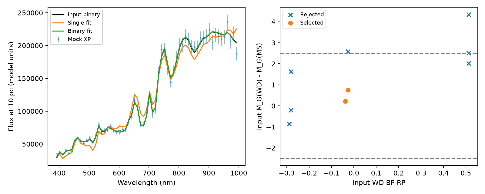

# WDMS XP selection

Turn simulated white-dwarf + main-sequence binaries into Gaia XP spectra, fit
single-star and binary hypotheses, and inspect which selection conditions pass.

The repository includes the original 61-pixel CMD-to-XP emulator and both
fit-initialization networks. Runtime inference uses NumPy and SciPy. The
physical-parameter route uses WD_models for the WD and a bundled PARSEC
main-sequence subset for the companion.

## Interactive notebook

Open [wdms_selection.ipynb](wdms_selection.ipynb) for the full simulation-to-selection
experiment, including component photometry, an XP fit, repeated noise draws,
selection fractions, and a comparison of chi-squared thresholds on the same fits.

```bash
python -m pip install -r requirements-notebook.txt
jupyter lab wdms_selection.ipynb
```

Start Jupyter from this repository directory and run the cells in order. The default
input is component CMD photometry, so no WD_models download or physical conversion
is needed. Replace `INPUT_CSV` with your table; physical-parameter inputs automatically
use the optional WD_models/PARSEC conversion. Each component needs BP−RP, M_G,
and M_RP. Results are saved in `results_notebook/`. The example runs nine binaries
with ten noise draws each.

## Run the example

Python 3.10 or newer:

```bash
python -m venv .venv
source .venv/bin/activate
python -m pip install -r requirements.txt
git clone --depth 1 https://github.com/SihaoCheng/WD_models.git external/WD_models
python run_mock.py examples/mock_parameters.csv --snr 20 --out results
```

An existing WD_models checkout can be supplied with `--wd-models /path/to/WD_models`.
Choose `--atmosphere He` for helium atmospheres; hydrogen is the default.

The example contains nine systems with WD masses of 0.4/0.6 solar masses,
WD temperatures of 7000/12000/20000 K, and MS masses of 0.3/0.5 solar masses.
It illustrates how selection depends on temperature and component contrast.



For a run using precomputed photometry:

```bash
python run_mock.py examples/mock_photometry.csv --out results_photometry
```

Run `python smoke_test.py` to check noiseless binary recovery and Gaussian error
scaling. Repeat an experiment with several `--seed` values to examine noise
variations in the selection response.

## Input

Use one CSV row per simulated binary. Additional columns are preserved in the output.

| Column | Meaning |
| --- | --- |
| `system_id` | Optional system identifier |
| `mass_wd` | WD mass, solar masses |
| `teff_wd` | WD effective temperature, K |
| `mass_ms` | Current MS mass, solar masses |
| `mh_ms` | MS metallicity [M/H], dex |
| `age_ms_gyr` | MS age, Gyr |

WD masses and temperatures are mapped to surface gravity and bolometric magnitude
using WD_models cooling tracks, then to Gaia EDR3 BP, G, and RP using its
atmosphere tables. The adopted cooling models are Bédard2020 at low/intermediate
mass and ONe at high mass. The MS magnitudes are linearly interpolated in
current mass, metallicity, and log age on the PARSEC main-sequence grid.

If the simulations already provide component magnitudes, supply these columns
instead; this route requires no WD_models download:

```text
system_id,bp_rp_wd,abs_g_wd,abs_rp_wd,bp_rp_ms,abs_g_ms,abs_rp_ms
```

All magnitudes are intrinsic absolute magnitudes. `abs_rp` denotes Gaia RP,
and `bp_rp` denotes BP-RP. Each component's three labels are converted into
linear flux on the same 10-pc scale, and the two fluxes are added.

## Noise and fitting

The XP grid is 392–992 nm in 10-nm steps. The default experiment uses independent
Gaussian noise with `sigma = abs(binary_flux)/snr` at every pixel. Both fits use
this same standard-deviation vector. Use `--seed` to set the random seed.

Both hypotheses retain the original absolute flux scale. Fits optimize the
component CMD coordinates with SciPy least squares and the original label
bounds. The binary labels are ordered WD then MS. Their initial guesses come
from the bundled original networks, without access to the simulated truth.

For direct fitting of an independently simulated XP spectrum:

```python
from wdms_xp import XPModel, selection

model = XPModel()
fit = model.fit(flux, sigma)  # each array has 61 pixels on model.wave_nm
flags = selection(fit)
```

Here `flux` and `sigma` must use the emulator's 10-pc flux scale. For a spectrum
at distance d, multiply both by `(d/10 pc)**2` after applying the desired
extinction treatment.

## Selection

The default follows the criteria in the manuscript's selection table:

1. Both reduced chi-squared values are below 20, using N−3 degrees of freedom
   for the single fit and N−6 for the binary fit.
2. Total binary chi-squared is smaller than total single chi-squared.
3. The fitted components differ by at most 2.5 mag in both G and RP.
4. The fitted WD satisfies `M_G > 9 + 2.5*(BP-RP)`.

Each condition has its own output flag. `pass_selection` is their conjunction;
`fit_converged` records optimizer convergence separately.

To evaluate the total-chi-squared threshold used in the archived notebook:

```bash
python run_mock.py examples/mock_parameters.csv --chi2-kind total --chi2-max 1000 --out results_total
```

## Outputs

- `selection.csv`: input parameters, component photometry, fitted parameters,
  total/reduced chi-squared, convergence diagnostics, and each selection flag.
- `spectra.npz`: `wave_nm`, zero-based `input_row` indices, and `spectra` with
  shape `(N_supported, 5, 61)`. The five arrays are noiseless input, noisy XP,
  standard deviation, single fit, and binary fit, in that order.
- `diagnostic.png`: an example spectrum and selection versus input WD color
  and G-band contrast.

Systems outside the photometry grid or original XP fitting bounds receive a
`status` value and blank fit/selection fields. Report their count separately;
the printed selection counts apply only to model-supported systems.

## Model provenance

`models/xp_model.npz` contains inference arrays from
`nnm_0713_cmd2xp_wdms_tune.pt`, `mlp_0603_xp2cmdini.pt`,
`mlp_0610_xp2wdinit_6.pt`, and the `0527` flux/label scalers used in the original
WDMS analysis. The NumPy forward calculation was checked against the original
LASPEC predictor, with maximum absolute difference below 2e-15 in scaled flux
for four component-label examples.

`models/parsec_ms.npz` is a subset of the original
`PARSEC_logage_6to10_MH_n2p5_0p6.csv`, retaining main-sequence rows (`label=1`)
with current mass below 1.5 solar masses. Its tabulated ages have log10(age/yr)
of 7.5, 8, 8.5, 9, 9.5, and 10; metallicities span approximately −2.19 to +0.6.
Only current mass, metallicity, age, and the three Gaia magnitudes are retained.

Please cite the [WDMS catalogue](https://zenodo.org/records/14411003),
[WD_models and its model references](https://github.com/SihaoCheng/WD_models),
and [PARSEC](https://stev.oapd.inaf.it/cgi-bin/cmd).

## Limitations

This is an experiment for XP fitting and selection response. It assumes
static, extinction-free, out-of-eclipse component spectra. The simple noise
model does not represent Gaia's full wavelength covariance or magnitude-dependent
selection. Generating and fitting with the same emulator measures its internal
response; realistic completeness also depends on model mismatch, XP availability,
the parent-sample cuts, and eclipsing-binary discovery selection.

The original emulator describes CMD coordinates rather than independent gravity,
metallicity, irradiation, or magnetic effects. Photometry interpolation and
rectangular fitting bounds do not establish coverage of every physical spectrum.
WD conversion imposes the adopted cooling-model mass–radius relation. Low-mass
WDs, atmosphere choices, and post-interaction companions may require different
models when comparing to specific simulations.

The archived selection notebook, manuscript prose/table, and published catalogue
do not specify one fully consistent quality cut. These explicitly stated cuts
allow threshold experiments; exact reproduction of the published 1649-row
catalogue remains unverified.
